# URY Production Flow — Complete Guide

**Scope:** This is the single reference for understanding, configuring, and testing URY's item
production control system — the machinery that decides whether a menu item can be sold, how it's
produced (pre-made batch vs. cooked on demand), and how that ties into recipes (BOMs), kitchen
routing, and the POS/Captain ordering apps.

**Base:** `ury-erp/ury`, branch **`v3-stg`** (verified against commit `86175fb`, which includes the
`sa-production-control-unification` and `sa-testing-issues-round2` tracks — the Production Unit →
POS Profile link and the Sales Plan fixes described below are both present at this commit).

**Live-tested on:** a disposable bench restored from the shared reference dataset (real seeded
company "URY", branch "URY Branch", POS Profile "URY", existing raw-material catalog). Every
screenshot in this doc is a real, working screen from that bench — nothing is mocked.

---

## 1. Why this exists

A restaurant's menu has two fundamentally different kinds of items:

- **Pre-produced items** — cooked in batches ahead of service and held as finished stock (a pot of
  biryani, a tray of dessert). Selling one is a stock check: is there a portion left?
- **Made-to-order items** — cooked fresh per order (a wok-fried Chinese dish, a grilled item).
  Selling one is a *capacity* check: do we have enough raw ingredients on hand to cook it right now?

Before this system existed, availability logic was duplicated and inconsistent across Captain POS,
the cashier POS, order acceptance, and kitchen ticket (KOT) routing — each had its own partial,
slightly different idea of "is this item available." **`get_item_availability()`** unifies all of
that into one authoritative function that every consumer calls, so a menu item is either sellable
everywhere or blocked everywhere, for the same reason, at the same moment.

The system also governs:
- **Recipe management** — what raw materials a dish actually consumes (BOM).
- **Kitchen routing** — which physical station/department prepares a given item.
- **Stock reservation** — soft-locking ingredients the instant an order is placed, so two
  simultaneous orders can't oversell the same last portion of chicken.
- **Sales planning** — an optional daily-quantity gate ("we're only planning to sell 40 biryanis
  today") layered on top of raw stock/capacity.

---

## 2. The worked example: Biryani (pre-produced) vs. Chinese wok dishes (made-to-order)

This guide uses three real menu items, set up end-to-end on the test bench, to make every concept
concrete:

| Item | Item Code | Policy | Why |
|---|---|---|---|
| **Chicken Biryani** | `CHKBIR-DOC` | `PRE_PRODUCED` | Classic batch-cooked dish, held as finished stock in a hot case. |
| **Chicken Manchurian** | `CHKMAN-DOC` | `MADE_TO_ORDER` | Wok-fried on demand per order. |
| **Chilli Chicken** | `CHLCHK-DOC` | `MADE_TO_ORDER` | Wok-fried on demand per order. |

Manchurian and Chilli Chicken share **four overlapping raw ingredients** — exactly the scenario
that makes made-to-order capacity checking interesting, since selling one dish reduces how many of
the *other* dish can still be made:

| Ingredient | Item Code | In Biryani? | In Manchurian? | In Chilli Chicken? |
|---|---|:---:|:---:|:---:|
| Chicken Boneless Breast | `CBB` | ✅ (0.15 kg) | ✅ (0.18 kg) | ✅ (0.18 kg) |
| Red Chilly Sauce | `RDCHLS700` | | ✅ (0.03 Nos) | ✅ (0.03 Nos) |
| Spring Onion | `SPN` | | ✅ (0.02 kg) | ✅ (0.02 kg) |
| Green Capsicum | `GRCPSM` | | ✅ (0.03 kg) | ✅ (0.03 kg) |
| Onion | `ONN` | ✅ (0.05 kg) | ✅ (0.03 kg) | |
| Ginger | `GING` | ✅ (0.01 kg) | | ✅ (0.01 kg) |
| Garlic | `GAR` | ✅ (0.01 kg) | ✅ (0.01 kg) | |
| Basmati Rice | `BASRIC` | ✅ (0.25 kg) | | |

Because `CBB` (chicken breast) is shared, and — given the stock levels seeded on this bench — is the
tightest ingredient relative to demand, it's the **blocking component** for both Chinese dishes:
selling out of chicken blocks both Manchurian and Chilli Chicken simultaneously, which is exactly
the real-world behavior a shared-ingredient model should produce. (Which ingredient actually ends
up "tightest" is a property of stock levels on the day, not of the BOM itself — restock any
component and a different one may become the binding constraint.)

---

## 3. The doctypes — what each one is for

### 3.1 `URY Item Production Configuration` (the central row)

One row per **(item, branch)** pair. This is the doctype that actually turns a plain sellable
`Item` into a "how do we make/track this" record. Fields:

| Field | Meaning |
|---|---|
| `active` | Must be checked for this row to be considered at all. |
| `item` / `branch` | The item and branch this configuration applies to (company is derived from the branch). |
| `production_policy` | **`PRE_PRODUCED`**, **`MADE_TO_ORDER`**, or **`DIRECT_RETAIL`** (a third policy — pure stock, no BOM, no plan, e.g. a bottled drink). |
| `department` | Not marked mandatory on the form itself, but effectively required for every policy — a missing one is caught at availability-check time (`MISSING_DEPARTMENT`), not at save time. The kitchen section responsible (e.g. "Kitchen", "Bar"). |
| `production_unit` | Same story: not form-mandatory, but effectively required for `PRE_PRODUCED` and `MADE_TO_ORDER` (optional for `DIRECT_RETAIL`) — a missing one surfaces as `MISSING_PRODUCTION_UNIT` at availability-check time. The physical station within the department. |
| `bom` | The recipe. Must belong to the same item and company. |
| `controlled_by_sales_plan` | If checked (default), the item additionally needs an approved Sales Plan quantity for the day — see §3.5. |
| `allow_over_plan_sale` | If the day's plan is exhausted but raw stock/capacity remains, sell anyway using stock alone. |
| `availability_mode` | `Plan Available` (normal), `Always Available` (force-sellable, but never overrides a genuine config error like a missing BOM), or `Stock Available` (reserved for future use — not implemented yet). |
| `direct_retail_warehouse` | The finished-goods warehouse to check stock in — used by `PRE_PRODUCED` and `DIRECT_RETAIL`. |

**Screenshot — Item Production Configuration list**, showing all three test items configured:

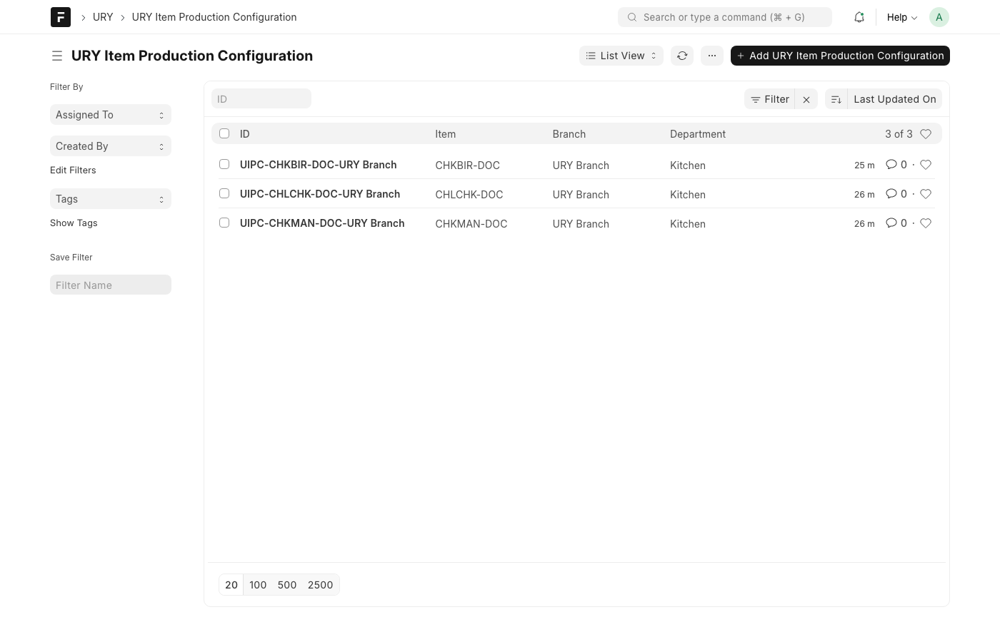

**Screenshot — Chicken Biryani configured as PRE_PRODUCED** (`Direct Retail Warehouse` is the
finished-goods stock location; no BOM component check happens at sale time — only the finished
item's own stock does):

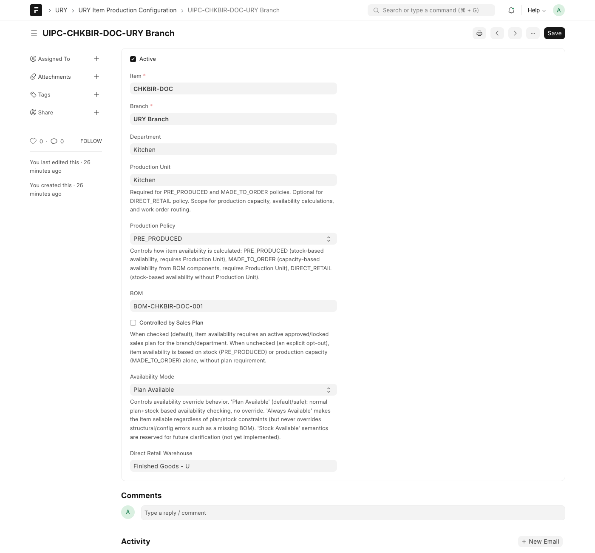

**Screenshot — Chicken Manchurian configured as MADE_TO_ORDER** (note the inline help text Frappe
renders for every field — this doctype is thoroughly self-documenting in the UI itself):

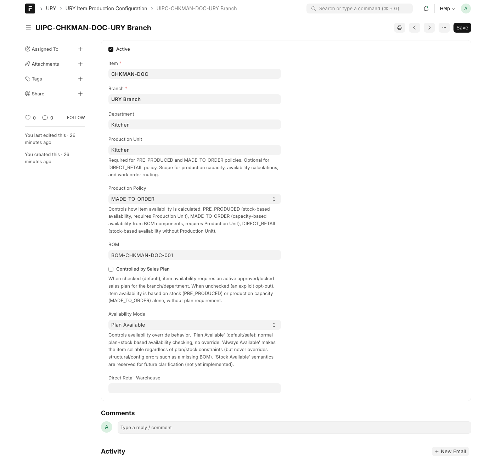

*Path:* Desk → search "URY Item Production Configuration", or `/app/ury-item-production-configuration`.
*Role needed:* System Manager / URY Manager (standard Desk access — this is a back-office config
doctype, not exposed in the cashier/captain apps). There's also a dedicated frontend page,
`ItemProductionConfigPage.tsx`, mirroring every field.

### 3.2 `URY Production Department` and `URY Production Unit`

A **Department** is the kitchen section (e.g. "Kitchen", "Bar"); a **Production Unit** is a
physical station within it. Every Production Unit belongs to exactly one Department.

**Screenshot — Production Department "Kitchen"**:

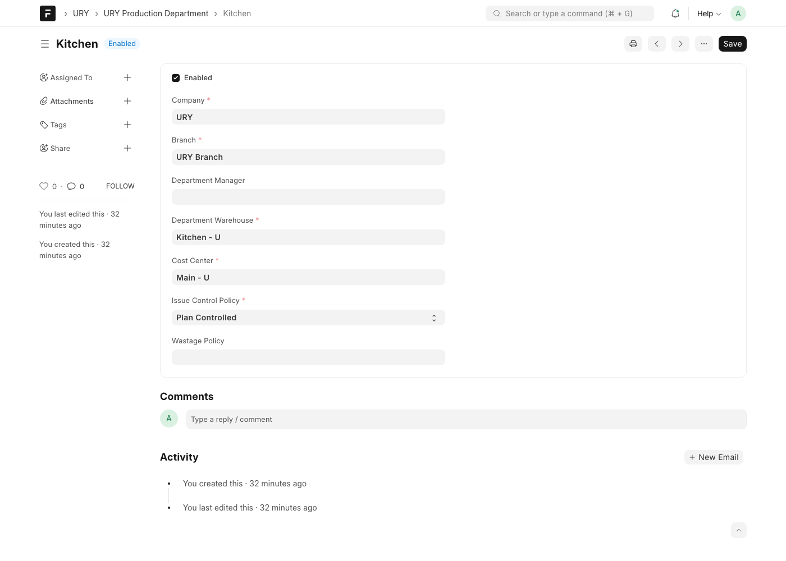

Note `Department Warehouse` and `Cost Center` — the warehouse here is a **fallback** used for
made-to-order component lookups only when the Production Unit itself has no warehouse set (see
next).

**Screenshot — Production Unit "Kitchen"**, showing the `POS Profile` field:

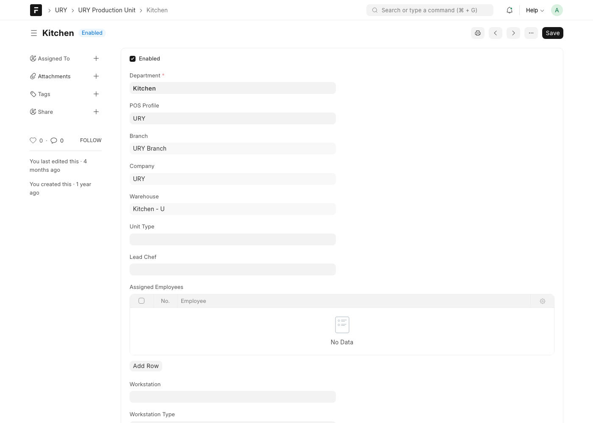

This `POS Profile` field is the key recent addition: **`Branch` and `Warehouse` on a Production
Unit are now derived directly from its linked POS Profile** (they're read-only, fetched fields) —
not entered independently. This closes a real class of bug where a unit's warehouse could silently
drift out of sync with which POS Profile it actually serves. Practically, this also means: if a
Production Unit's POS Profile is ever blank, its branch/warehouse go blank too, and made-to-order
component lookups for that unit fall back to the Department's own warehouse instead.

*Paths:* `/app/ury-production-department`, `/app/ury-production-unit`. There are also dedicated
frontend config pages (`ProductionDepartmentPage.tsx`, `ProductionUnitPage.tsx`) for managers who
don't want to use Desk directly.

### 3.3 BOM (recipe) — standard ERPNext doctype

BOMs are managed entirely through the standard Frappe/ERPNext BOM form (no custom URY frontend for
this — recipes are exactly as complex as ERPNext's BOM already handles, so there was no reason to
reinvent it).

**Screenshot — BOM for Chicken Manchurian**, showing all 6 raw materials with quantities:

**Screenshot — BOM for Chilli Chicken** (four of its five ingredients — `CBB`, `RDCHLS700`, `SPN`,
`GRCPSM` — are the same items at the same quantities as Manchurian's; this is the overlap in
action):

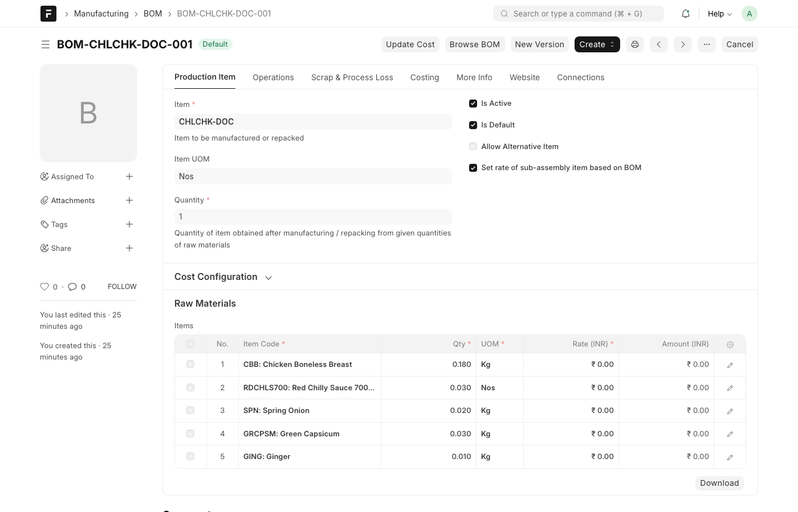

**Screenshot — BOM for Chicken Biryani** (pre-produced item's recipe — used only for costing and
production planning, *not* consulted at sale time the way a made-to-order BOM is):

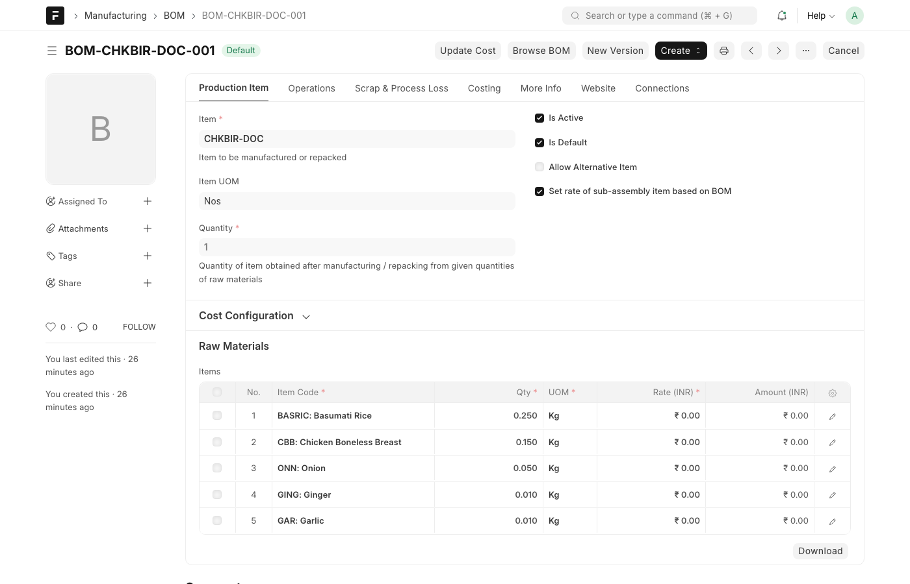

A BOM is considered the "live" recipe for an item when it is **submitted** (`docstatus = 1`) and
**`is_active = 1`**; if more than one such BOM exists for the same item, the one with
**`is_default = 1`** wins, tie-broken by most-recently-modified. The availability/reservation engine
re-resolves this itself every time — it does not simply trust whatever is typed into the `bom`
field on the Item Production Configuration row — that field is only checked for item/company
ownership when you save. Separately (independent of what's typed into `bom`), saving a
`MADE_TO_ORDER` configuration that has a `department` set triggers a cross-department check: the
system re-resolves the item's own active BOM itself, explodes it, and refuses to save if any raw
component in it already has its own active configuration in this branch pointing at a *different*
department — preventing two kitchen sections from unknowingly fighting over the same ingredient.

*Path:* `/app/bom/<name>`, or Manufacturing workspace → BOM.
*Role needed:* Manufacturing User / System Manager.

### 3.4 The unified availability engine — `get_item_availability()`

This is the function every consumer (Captain POS, cashier POS, order sync, KOT routing display)
calls to answer "can I sell this item right now, and how many?" It:

1. Looks up the item's `URY Item Production Configuration` row for the branch (exactly one active
   match required — ambiguous or missing configuration fails closed).
2. Branches on `production_policy`:
   - **`PRE_PRODUCED`** → checks the *finished item's own stock* in its configured warehouse
     (net of anything already reserved by other pending orders).
   - **`MADE_TO_ORDER`** → explodes the BOM into its raw components, checks *each component's*
     available stock in the production unit's warehouse, and computes
     `capacity = floor(min(component_available / qty_per_dish))` across all components — the
     tightest ingredient is reported as the `blocking_component`.
   - **`DIRECT_RETAIL`** → a plain stock check on the item itself, no BOM, no plan.
3. If `controlled_by_sales_plan` is on, further caps the result at the day's remaining planned
   quantity (see §3.5) — unless `allow_over_plan_sale` is on and stock/capacity still exists.

The key structural difference to internalize: **a made-to-order item's own stock ledger is never
checked** — only whether enough raw ingredients exist to cook it. A pre-produced item's *ingredient*
stock is never checked at sale time — only whether a finished portion already exists.

### 3.5 `URY Sales Plan` and the plan gate

Optional, per-item, via `controlled_by_sales_plan`:

- **On (default):** the item can only sell against an **Approved** or **Locked for Production**
  Sales Plan for that branch and day. No plan → `NO_ACTIVE_PLAN`, hard-blocked regardless of stock.
- **Off:** the Sales Plan is bypassed entirely; availability is pure stock/capacity, as described
  above. **This is how the test items in this guide are configured** — `controlled_by_sales_plan`
  is unchecked on all three, so you can test pure stock/capacity behavior without first building a
  daily Sales Plan. Flip it on and approve a plan to see the additional gate in action.

`allow_over_plan_sale` softens the plan gate: if the plan quantity is used up but real stock or
capacity remains, the item stays sellable using stock/capacity alone instead of hard-blocking.

One scoping detail worth knowing when a plan-gated item unexpectedly shows `NO_ACTIVE_PLAN` despite
an Approved plan existing: the lookup also matches on the resolved **department**, via `URY Sales
Plan Item.department`. A plan whose item rows have a blank or different department than the one
your Item Production Configuration resolves to simply won't be found.

### 3.6 Stock reservation — the "soft lock"

Doctype: `URY Stock Reservation`. The moment an order is accepted (not just added to a cart client-side, but synced to the server — see §5), the system reserves stock so a second, concurrent order can't oversell the same item:

- **Pre-produced:** one reservation row against the *finished item's own* stock.
- **Made-to-order:** one reservation row **per exploded BOM component**, all sharing one
  `reservation_group`, created atomically (all components must have capacity, or nothing is
  reserved).

**Screenshot — Stock Reservation list**, showing 6 rows from a single made-to-order order (2
portions of Chicken Manchurian → 6 reserved component rows, one per BOM ingredient, all sharing
reservation group `c590eaadf1`):

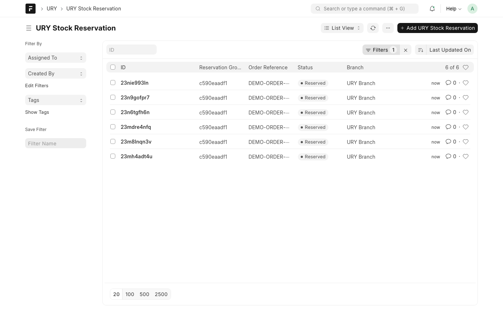

This is a **soft hold** — it reduces what other orders see as "available," but no stock ledger
entry has been posted yet. That happens at fulfilment (next section).

### 3.7 When is the BOM actually "executed"? (the two-step lifecycle)

This is the single most commonly misunderstood part of the system. For a made-to-order item, two
separate things happen at two separate times:

1. **Reservation (BOM *explosion*, not consumption)** — happens the moment the order line is
   accepted/synced to the server (see §5). The BOM is exploded and every raw component is
   soft-reserved. **No stock is actually deducted yet.**
2. **Fulfilment (actual stock consumption)** — happens when the kitchen marks the **KOT item**
   **Ready** (`mark_item_ready()`). That creates a durable `URY Fulfilment Posting Intent` and
   enqueues it; a background worker then submits a **`Material Issue` Stock Entry** for the frozen
   component list, and only after that Stock Entry submits does the reservation flip to
   `Fulfilled`. Marking an item **Served** afterwards does not post anything further — Served is a
   front-of-house state, not an inventory event. (There's also a scheduled recovery job,
   `recover_pending_posting_intents`, that retries any posting intent that didn't complete.)

So: adding an item to a cart reserves ingredients (protecting against oversell), but the ingredients
are only actually *consumed from stock* once the kitchen marks the item Ready — via an asynchronous
background posting, not synchronously in the same request — not at KOT print, and not at order
placement in the sense of "stock immediately goes down." Printing a KOT is a pure *instruction*
artifact to the kitchen; it doesn't touch reservations or stock at all.

Pre-produced items skip step 1's BOM explosion entirely (they reserve their own already-finished
stock directly) but still go through the same fulfilment-on-ready/served gate for step 2.

> **Historical bug, now fixed:** an earlier version of the reservation engine
> (`_resolve_components()` in `ury_reservation_service.py`) decided whether to reserve raw
> components by asking "does this item have an active BOM" rather than by its `production_policy`.
> Since PRE_PRODUCED items commonly *do* have a BOM attached (for costing/production planning —
> see §3.3), this incorrectly exploded it and reserved raw-ingredient stock instead of the finished
> item's own stock, leaking ingredient names into a customer-facing error on a real test item
> (a pizza that was correctly marked sellable by `get_item_availability()`, then failed at
> reservation with a raw-material shortfall error). It's now fixed by branching explicitly on
> `production_policy`: `PRE_PRODUCED`/`DIRECT_RETAIL` always resolve to the item itself as the sole
> reservation target, matching §3.6 and §3.7 above. A legacy fallback (used only when no
> `production_policy` is supplied at all) still relies on the old BOM-presence heuristic, but now
> logs a warning so any caller not yet passing `production_policy` is visible rather than silently
> reintroducing the bug.

### 3.8 Kitchen ticket (KOT) routing

When an order is accepted, each line item is routed to a Production Unit so the right kitchen
station prints/sees it:

1. **Exact match** — the item's `URY Item Production Configuration` row names a `production_unit`
   directly. This is the primary, current mechanism (both test dishes and Biryani route this way,
   all to "Kitchen").
2. **Legacy fallback** — if no configuration row exists, the system falls back to matching the
   item's `Item Group` against each Production Unit's configured item-group list (the older,
   pre-unification routing mechanism, kept for items that haven't been migrated to explicit
   configuration yet).
3. **Ambiguous or unconfigured** — the item is skipped from KOT generation entirely and a warning
   is surfaced, rather than guessing.

One KOT document is created per Production Unit per order (so if an order has items for both
"Kitchen" and "Bar", two separate KOTs are printed). Whether an item is pre-produced or
made-to-order makes **no difference to KOT routing mechanics** — the policy only affects
availability (§3.4) and which fulfilment path runs once the KOT reaches Ready/Served (§3.7).

### 3.9 POS Profile — the shared identity anchor

**Screenshot — POS Profile "URY" in Desk**, showing the `Applicable for Users` list (this is the
actual permission gate for who may open a session against this profile — see §5's role notes) and
`role_allowed_for_billing`:

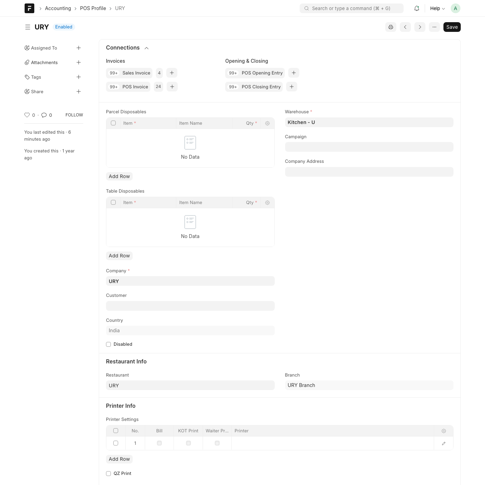

A cashier or captain's session is always tied to a POS Profile → branch. Production Units resolve
their own branch/warehouse from whichever POS Profile they're linked to (§3.2), so the whole chain
is: **POS session → POS Profile → branch → Production Units in that branch → item routing (§3.8) →
warehouse used for made-to-order component reservation.**

---

## 4. Configuration checklist — setting this up for a new item

To make a new dish sellable end-to-end:

1. **Create the Item** (standard Item master — item group, stock UOM, etc.)
2. **Create a BOM** for the item if it's `PRE_PRODUCED` or `MADE_TO_ORDER` — list every raw
   component and its quantity per unit produced. Submit it, and set `Is Active` + `Is Default`.
3. **Ensure a Production Department and Production Unit exist** for the branch (usually already
   set up once per kitchen section — you're unlikely to create these per-item).
4. **Create a `URY Item Production Configuration` row**:
   - Pick the item and branch.
   - Pick `production_policy`.
   - Pick `department` and (for PRE_PRODUCED/MADE_TO_ORDER) `production_unit`.
   - Link the `bom`.
   - Decide `controlled_by_sales_plan` (leave off for simple testing).
   - For `PRE_PRODUCED`/`DIRECT_RETAIL`, set `direct_retail_warehouse`.
5. **Stock the right warehouse**:
   - `PRE_PRODUCED`: put finished units of the item itself into `direct_retail_warehouse`.
   - `MADE_TO_ORDER`: put raw components into the Production Unit's warehouse. Remember this
     warehouse isn't set directly on the Production Unit — it's derived from whichever POS Profile
     the unit is linked to (§3.2), falling back to the Department's own warehouse if the unit has
     none. Check *that* field, not the unit form, if components aren't showing as stocked where
     you expect.
6. **Add the item to a `URY Menu`** (with a price) so it's visible in POS/Captain — see the
   screenshot below.
7. **Verify** by calling/checking `get_item_availability()` for the item, or simply opening
   POS/Captain and confirming it shows as sellable (not "Temporarily unavailable").

**Screenshot — Default Menu**, showing Chicken Biryani, Chicken Manchurian, and Chilli Chicken
added under "Main Courses" with prices:

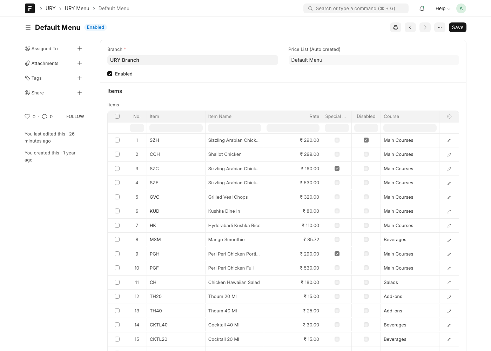

*Path:* `/app/ury-menu/Default Menu` (or whichever menu your branch uses — `URY Menu.price_list`
determines which Item Price records apply).

---

## 5. Testing the flow live — step by step

### 5.1 Roles and test users

The seeded demo data already includes dedicated, purpose-built test accounts — use these rather
than Administrator so you're testing real role-based behavior:

| Role | User | Purpose |
|---|---|---|
| **URY Cashier** | `urycashier@gmail.com` | Runs the desktop/counter POS (`/pos`), takes billing. |
| **URY Captain** | `urycaptain@gmail.com` | Runs the mobile table-ordering app (`/pos/order`). |
| **URY Manager** | (seed-dependent) | Back-office config: Item Production Configuration, BOM, Sales Plan approval. |
| **Administrator / System Manager** | — | Full Desk access to every doctype in this guide. |

> **Known configuration gap, worth knowing about:** the app already hard-codes `URY Captain` (and
> `URY Cashier`/`URY Manager`) into its allowed-roles check (`config-slice.ts`'s `URY_POS_ROLES`),
> so a Captain login does *not* need any `role_allowed_for_billing` change to pass that gate. What
> **does** still need a one-time setup step on the POS Profile is
> **`Applicable for Users`** (the `applicable_for_users` child table): `_get_allowed_pos_profiles()`
> only offers a profile to a user if that table is empty (meaning "everyone") or explicitly lists
> them. In the seeded demo data this table already had the cashier in it — which, non-obviously,
> made it *non-empty* and therefore excluded every other user, including the captain, by omission.
> Add the captain's user to `Applicable for Users` (or clear the table entirely, which reopens it to
> everyone) before trying to reproduce the Captain screenshots below.
>
> Two more permission gates you may hit only the first time a fresh user opens their own session:
> Frappe's own `POS Opening Entry` doctype permission needs `create`/`write`/`submit` for the
> `URY Captain` role (the "you don't have permission to open a session" message if not), and that
> user needs to appear in the target `Branch`'s own `user` child table (the "User is not Associated
> with any Branch" error if not). Neither of these is specific to production-control logic — they're
> generic POS/branch bootstrapping any new staff login needs — but they'll block you before you ever
> see an availability-related screen if a fresh test user hits them.

### 5.2 Cashier flow — desktop POS (`/pos`)

1. Log in as `urycashier@gmail.com`.
2. Navigate to `/pos`. If no session is open yet, you'll see the **Open POS Session** screen —
   confirm the branch/POS Profile, optionally declare an opening cash balance, and confirm.
3. Go to the **POS** tab (`/pos/register`). All sellable items for the branch render as cards; an
   item that fails availability shows **"Temporarily unavailable."**
4. Click Chicken Biryani, Chicken Manchurian, and Chilli Chicken to add them to the cart.

**Screenshot — POS with all three items in the cart** (₹760 total — this is the exact "cart added"
state, showing quantity controls, per-line edit/delete, and the running total):

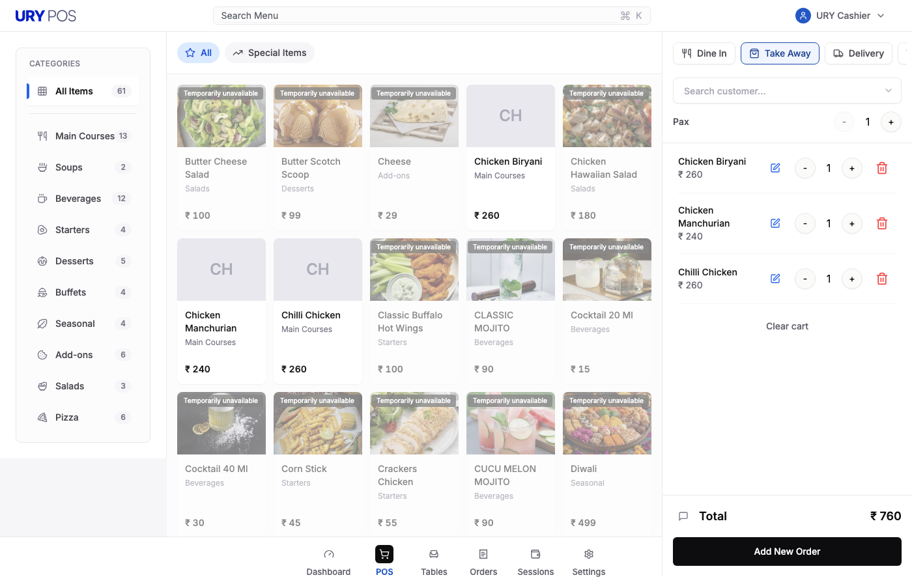

Some items (depending on exact click timing/UI state) open a small **customization dialog**
first — special instructions and quantity — before landing in the cart:

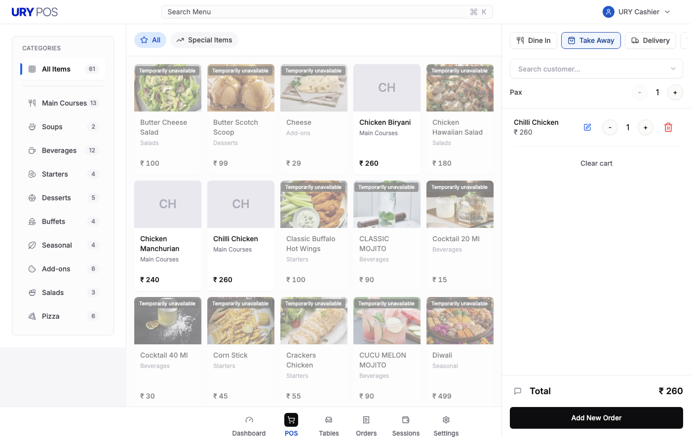

### 5.3 Captain flow — mobile table ordering (`/pos/order`)

Once the role/profile setup in §5.1 is done:

1. Log in as `urycaptain@gmail.com` on a phone-width viewport (or resize your browser to ~390px
   wide to preview the mobile-first layout).
2. Navigate to `/pos/order`. If prompted, open a POS session the same way as the cashier flow —
   each staff member who logs into the shared POS app opens their **own** per-user session.
3. You'll land on the **Tables** view.

**Screenshot — Captain Tables view (mobile, 390×844)**:

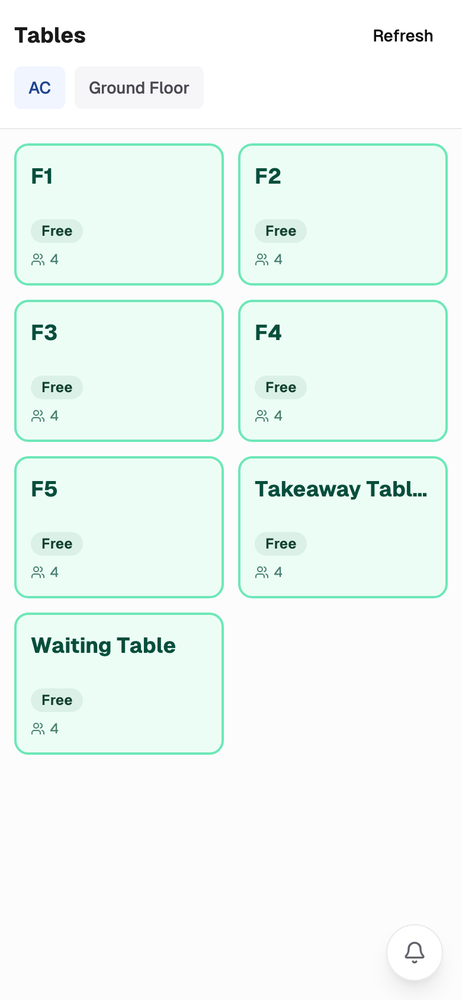

4. Tap a free table (e.g. "F1") to start a new order for it, then add the same three items.

**Screenshot — Captain Order screen for Table F1 (mobile)**, showing the item grid, the "Order (3)"
badge, and the running total with a **Send Order** action:

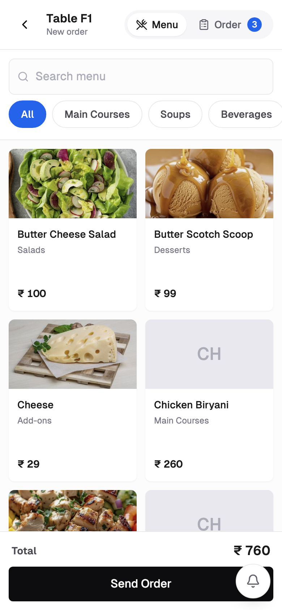

5. Tapping **Send Order** is what actually syncs the order to the server — this is the moment that
   triggers availability re-verification and BOM-component reservation (§3.6/§3.7), not the earlier
   client-side "add to cart" taps.

### 5.4 Verifying the reservation and BOM-execution behavior

After sending an order containing a made-to-order item, verify the mechanics directly in Desk:

1. Open **`/app/ury-stock-reservation`**, filter by the order's reference. You should see one row
   per BOM component of every made-to-order line (see the 6-row screenshot in §3.6 — 2× Chicken
   Manchurian's 6-ingredient BOM produced 6 reservation rows, all `Reserved`, sharing one
   `reservation_group`).
2. Confirm **no stock ledger entry exists yet** for those components (check Stock Ledger — the
   reservation is a soft hold, not a posting).
3. In the kitchen flow, mark the corresponding **KOT item** Ready (via the KDS/Mosaic kitchen
   display, or the KOT Item Execution doctype directly) — marking it Served afterwards is a
   front-of-house state only and doesn't trigger anything further.
4. Give it a moment — posting runs on a background worker, not synchronously with the Ready
   action. Re-check the reservation shortly after: its status should move to `Fulfilled`, and you
   should find a submitted **`Material Issue` Stock Entry** against the raw components (confirming
   step 2 of §3.7 actually ran — this is the real, physical stock deduction).
5. To test the **shared-ingredient blocking** behavior specifically: keep placing Manchurian and
   Chilli Chicken orders and watch `get_item_availability()` (or just the POS/Captain "Temporarily
   unavailable" badge) for *both* items — since they share `CBB` (chicken breast) as their tightest
   ingredient, selling enough of one will eventually block the other too, even though its own
   distinct ingredients (onion for Manchurian, ginger for Chilli Chicken) are unaffected.

### 5.5 Testing the pre-produced path specifically

1. Confirm stock of `CHKBIR-DOC` (Chicken Biryani) exists in its configured
   `direct_retail_warehouse`.
2. Sell portions via POS/Captain and confirm the item's shown "available quantity" decreases in
   step with the finished-stock count — *not* with any raw ingredient (Biryani's own BOM is for
   costing/production only; it is not re-checked at sale time the way a made-to-order BOM is).
3. Sell down to zero and confirm the item correctly shows unavailable. Internally, the system
   distinguishes two distinct-but-both-unsellable states: **`FG_OUT_OF_STOCK`** — physical stock
   still shows in the Bin, but it's fully claimed by active reservations (i.e. orders are placed
   faster than they're fulfilled) — versus **`NOT_PRODUCED`** — the Bin's actual on-hand quantity
   itself has hit zero (nothing physically left, reserved or not). You'll typically see
   `FG_OUT_OF_STOCK` first (reservations outpacing fulfilment) and `NOT_PRODUCED` only once the
   underlying stock is truly gone.

---

## 6. Quick reference — where everything lives

| Concept | Frappe path | Frontend page |
|---|---|---|
| Item Production Configuration | `/app/ury-item-production-configuration` | `ItemProductionConfigPage.tsx` |
| Production Department | `/app/ury-production-department` | `ProductionDepartmentPage.tsx` |
| Production Unit | `/app/ury-production-unit` | `ProductionUnitPage.tsx` |
| BOM | `/app/bom` | *(none — standard Desk form)* |
| POS Profile | `/app/pos-profile` | `PosProfilePage.tsx` |
| Sales Plan | `/app/ury-sales-plan` | `/ury/sales-plan` |
| Stock Reservation | `/app/ury-stock-reservation` | *(none — Desk only)* |
| Menu | `/app/ury-menu` | *(configured via Desk; consumed by POS/Captain/self-order)* |
| Cashier POS | — | `/pos` |
| Captain mobile ordering | — | `/pos/order` |

---

## 7. Glossary of availability reason codes

Returned by `get_item_availability()` — useful when debugging why an item isn't showing as
sellable:

| Code | Meaning |
|---|---|
| `AVAILABLE` | Sellable, with a computed `available_qty`. Availability is based on `Bin.projected_qty` net of active URY reservations, not raw `actual_qty`. |
| `NOT_PRODUCED` | Pre-produced item's Bin `actual_qty` is `<= 0` — nothing physically on hand, reserved or not. |
| `FG_OUT_OF_STOCK` | Pre-produced/direct-retail item has physical stock, but it's fully claimed by active reservations. |
| `BLOCKING_COMPONENT` | Made-to-order item has zero producible capacity — see `blocking_component` for which raw ingredient ran out. |
| `NO_ACTIVE_PLAN` | `controlled_by_sales_plan` is on and no Approved/Locked-for-Production plan exists for today (scoped to the resolved branch **and department** — a plan row with a mismatched/blank department won't match). |
| `PLAN_EXHAUSTED` | Today's planned quantity is used up (and `allow_over_plan_sale` is off). |
| `MISSING_BOM` | Made-to-order item has no resolvable active/submitted BOM (MADE_TO_ORDER only — the other two policies don't need one). |
| `MISSING_DEPARTMENT` / `MISSING_PRODUCTION_UNIT` | Configuration row is incomplete — neither field is form-mandatory, so this is caught here rather than at save time. |
| `DEPARTMENT_DISABLED` / `PRODUCTION_UNIT_DISABLED` | The linked department/unit is turned off. |
| `CONFIGURATION_ERROR` | Catch-all — no matching/ambiguous configuration row, a required link is broken, or (for PRE_PRODUCED/DIRECT_RETAIL) `direct_retail_warehouse` is blank. |

**A note on `availability_mode = "Always Available"`:** this override rewrites a *commercial*
reason code (`NOT_PRODUCED`, `FG_OUT_OF_STOCK`, `BLOCKING_COMPONENT`, `PLAN_EXHAUSTED`,
`NO_ACTIVE_PLAN`) to `AVAILABLE`, but it never masks a *structural* one (`MISSING_BOM`,
`CONFIGURATION_ERROR`, `MISSING_DEPARTMENT`, `DEPARTMENT_DISABLED`, `PRODUCTION_UNIT_DISABLED`,
`MISSING_PRODUCTION_UNIT`). If you've set an item to "Always Available" and it's still showing
unsellable, the reason code you're seeing is one of the structural ones above — fix the
configuration itself, since the override can't paper over it.
