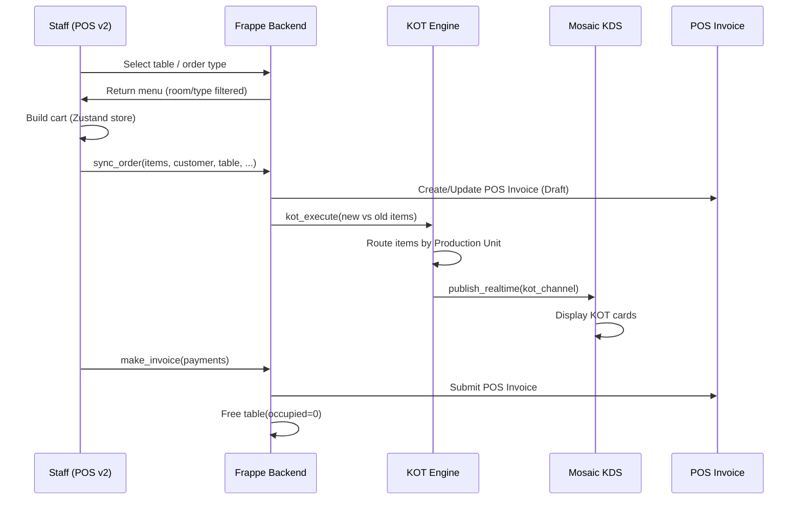

# 1. Repository Understanding

## Overall Repo Structure

URY is a **Frappe app** installed on top of **ERPNext**. The monorepo contains one Python backend module and three separate frontend apps.

```
ury-repo/
├── ury/                    # Frappe Python app (backend)
│   ├── hooks.py            # App hooks, doc_events, route rules, fixtures
│   ├── ury/                # "URY" module — core doctypes, APIs, reports
│   │   ├── api/            # Whitelisted API endpoints (KOT, printing, validation)
│   │   ├── doctype/        # ~30 doctypes (restaurant, table, menu, KOT, order, etc.)
│   │   ├── hooks/          # Document event handlers (POS Invoice, POS Profile, etc.)
│   │   ├── report/         # 14 Frappe script reports
│   │   └── page/           # websocket_print page
│   ├── ury_pos/            # "URY POS" module — single api.py (723 lines)
│   ├── public/             # Static assets, client scripts
│   ├── www/                # Web page entry points (pos.html, urypos.html, URYMosaic.html)
│   └── fixtures/           # Custom fields, property setters, roles, client scripts
├── pos/                    # React/TypeScript POS v2 frontend (Vite + Zustand + Tailwind)
├── urypos/                 # Vue.js POS v1 frontend (Vite + Pinia)
├── URYMosaic/              # Vue.js Kitchen Display System (KDS/Mosaic)
└── package.json            # Root workspace — install/build scripts for all 3 frontends
```

## Route Mapping (from `hooks.py`)

| Route | Frontend App | Purpose |
|-------|-------------|---------|
| `/pos/<path>` | `pos/` (React v2) | Desktop cashier POS |
| `/urypos/<path>` | `urypos/` (Vue v1) | Mobile captain/order-taker POS |
| `/URYMosaic/<path>` | `URYMosaic/` (Vue) | Kitchen Display System |

## Frontend Architecture

### POS v2 (`pos/`) — Primary active frontend
- **Stack**: React 19, TypeScript, Vite, Zustand, Tailwind CSS, `frappe-js-sdk`
- **State**: Single Zustand store ([pos-store.ts](file:///tmp/ury-repo/pos/src/store/pos-store.ts) — 695 lines)
- **API layer**: Individual TypeScript modules in `src/lib/` wrapping `frappe-js-sdk`
  - [order-api.ts](file:///tmp/ury-repo/pos/src/lib/order-api.ts) — `sync_order`, `getTableOrder`
  - [menu-api.ts](file:///tmp/ury-repo/pos/src/lib/menu-api.ts) — `getRestaurantMenu`, `getAggregatorMenu`
  - [payment-api.ts](file:///tmp/ury-repo/pos/src/lib/payment-api.ts) — `getPaymentModes`
  - [table-api.ts](file:///tmp/ury-repo/pos/src/lib/table-api.ts) — rooms, tables, layout
  - [auth-api.ts](file:///tmp/ury-repo/pos/src/lib/auth-api.ts) — Frappe session auth
  - [pos-profile-api.ts](file:///tmp/ury-repo/pos/src/lib/pos-profile-api.ts) — combined profile
  - [frappe-sdk.ts](file:///tmp/ury-repo/pos/src/lib/frappe-sdk.ts) — `FrappeApp` singleton
- **Pages**: `POS.tsx`, `Table.tsx`, `Orders.tsx`
- **UI Components**: 20+ components including `MenuCard`, `OrderPanel`, `PaymentDialog`, `TableSelectionDialog`, `CustomerSelect`, `SearchBar`, `Sidebar` (menu courses), etc.
- **UI primitives**: `src/components/ui/` — button, card, dialog, input, select, badge, toast, spinner

### POS v1 (`urypos/`) — Legacy mobile captain
- **Stack**: Vue 3, JavaScript, Vite, Pinia stores, Tailwind
- **Stores**: `Menu.js`, `Table.js`, `Customer.js`, `Auth.js`, `invoiceData.js`, `posOpening.js`, `posClosing.js`, `recentOrder.js`

### Mosaic KDS (`URYMosaic/`)
- **Stack**: Vue 3, JavaScript, Vite
- **Components**: Single `kot.vue` display + `Header.vue`
- Uses Frappe realtime (WebSocket) for KOT push updates

## Backend API Surface

### [ury_pos/api.py](file:///tmp/ury-repo/ury/ury_pos/api.py) (723 lines) — Main API

| Endpoint | Purpose |
|----------|---------|
| `getRestaurantMenu(pos_profile, room, order_type)` | Menu items with images, courses, prices |
| `getBranch()` / `getBranchRoom()` / `getRoom()` | User→Branch→Room resolution |
| `getModeOfPayment()` | Payment modes from POS Profile |
| `getPosProfile()` | Full POS config (cashier, printing, attention time, etc.) |
| `getPosInvoice(status, limit, offset)` | Invoice list by status |
| `getInvoiceForCashier(status, cashier, limit, offset)` | Cashier-filtered invoices |
| `searchPosInvoice(query, status)` | Search invoices |
| `get_select_field_options()` | Order type options |
| `fav_items(customer)` | Customer favorite items |
| `getAggregator()` / `getAggregatorItem()` / `getAggregatorMOP()` | Aggregator (Swiggy/Zomato) support |
| `create_customer(name, mobile)` | Quick customer creation |
| `getCashier(room)` | Active cashier for room |
| `validate_pos_close(pos_profile)` | Daily close validation |

### [ury_order.py](file:///tmp/ury-repo/ury/ury/doctype/ury_order/ury_order.py) (660 lines) — Core ordering

| Endpoint | Purpose |
|----------|---------|
| `sync_order(items, cashier, customer, table, ...)` | **The central order creation/update** — creates POS Invoice, triggers KOT |
| `get_order_invoice(table, invoiceNo, order_type)` | Gets/creates POS Invoice for table |
| `make_invoice(customer, payments, cashier, ...)` | Settles invoice — applies payments, submits |
| `cancel_order(invoice_id, reason)` | Cancels order + frees table + cancel KOTs |
| `table_transfer(table, newTable, invoice)` | Moves order between tables |
| `captain_transfer(current, new, invoice)` | Reassigns waiter |

### [ury_kot_generate.py](file:///tmp/ury-repo/ury/ury/api/ury_kot_generate.py) (405 lines) — KOT engine

- `kot_execute()` — Compares old/new items, generates New/Modified/Cancelled KOTs
- Routes items to correct Production Unit based on Item Group → Production Unit mapping
- Creates `URY KOT` documents that trigger realtime push to Mosaic KDS

## How Ordering Currently Works



## Current Logic: Internal vs Customer-Reusable

| Component | Currently | Reusable for Customer Apps? |
|-----------|-----------|--------------------------|
| Menu fetching | ✅ Exists | ⚠️ Partially — tied to POS Profile/Branch/User |
| Item/price/course model | ✅ Exists | ✅ Yes — clean ERPNext Item + Price List |
| Cart logic | ✅ Frontend Zustand | ⚠️ Needs extraction from POS store |
| Order creation (sync_order) | ✅ Exists | ❌ Requires staff user, cashier, POS Profile |
| KOT generation | ✅ Exists | ✅ Reusable after order creation |
| Payment settlement | ✅ make_invoice | ❌ Staff-only, no online payment gateway |
| Table management | ✅ Exists | ⚠️ Read-only part reusable for QR |
| Customer management | ✅ Basic | ⚠️ Needs guest/anonymous session |
| Auth | ✅ Frappe session | ❌ Staff-only, no customer/guest auth |
| Realtime (WebSocket) | ✅ KOT push | ✅ Reusable for order status |
| Printing | ✅ QZ/Network/Socket | ✅ Stays internal |
| Reports | ✅ 14 reports | ✅ Stays internal |
