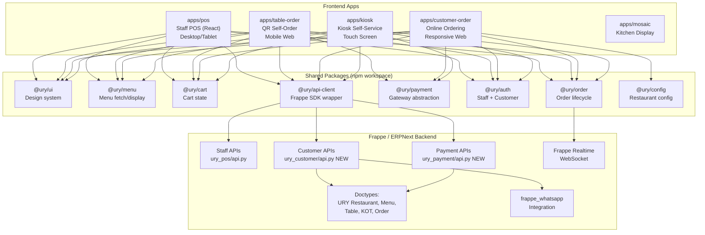

# 4. Architecture Recommendation

## Evaluation of Options

| Option | Pros | Cons | Verdict |
|--------|------|------|---------|
| **One large app with modes** | Simple deployment | Bloated bundle, auth complexity, single failure domain | ❌ |
| **Route-based split in single SPA** | Code sharing easy | Auth/session nightmare (staff vs customer in one app) | ❌ |
| **White-label shell over shared packages** | Max reuse | Over-engineered for current stage | ❌ |
| **Monorepo with domain packages + multiple app entry points** | Clean boundaries, shared code, independent deploy | More upfront setup | ✅ **Recommended** |

## Recommended Architecture

> **Multiple frontend apps** within the existing Frappe app monorepo, sharing domain logic through extracted packages. Each app has its own entry point, auth model, and route served via Frappe's `website_route_rules`.

### Why this fits URY:

1. **Already a monorepo** — `pos/`, `urypos/`, `URYMosaic/` already coexist with independent `package.json` and build scripts
2. **Frappe serves SPAs naturally** — `website_route_rules` in `hooks.py` already maps routes to SPA entry points
3. **Auth models are fundamentally different** — Staff uses Frappe session, customers need token/guest/OTP
4. **Bundle sizes differ** — Kiosk needs touch-optimized UI, QR needs mobile-first, POS needs desktop-dense
5. **Independent deployability** — Can ship QR app without touching POS

### Architecture Diagram



### Auth/Session Model

| App | Auth Type | Session Store | Implementation |
|-----|-----------|--------------|----------------|
| Staff POS | Frappe session (cookie) | Server-side | Existing — no change |
| QR Table Order | Signed table token (JWT in URL) | Stateless + optional guest cookie | **New** — token encodes restaurant + table + expiry |
| Customer Order | OTP login / guest checkout | Frappe OAuth2 token or guest session | **New** — `ury_customer/auth.py` |
| Kiosk | Pre-authenticated device token | Long-lived device token in localStorage | **New** — one-time setup per kiosk device |
| Mosaic KDS | Frappe session (staff) | Server-side | Existing — no change |

### Deployment Model

Each app builds to `ury/public/<app-name>/` and a corresponding `ury/www/<app-name>.html` entry point. Frappe's `website_route_rules` maps URLs:

```python
# hooks.py additions
website_route_rules = [
    {"from_route": "/pos/<path:app_path>", "to_route": "pos"},
    {"from_route": "/urypos/<path:app_path>", "to_route": "urypos"},
    {"from_route": "/URYMosaic/<path:app_path>", "to_route": "URYMosaic"},
    # NEW
    {"from_route": "/order/<path:app_path>", "to_route": "table-order"},
    {"from_route": "/menu/<path:app_path>", "to_route": "customer-order"},
    {"from_route": "/kiosk/<path:app_path>", "to_route": "kiosk"},
]
```

### Build Strategy

Root `package.json` already uses per-app install/build scripts. Extend with npm workspaces:

```json
{
  "workspaces": ["packages/*", "apps/*"],
  "scripts": {
    "build": "npm run build --workspaces",
    "build:pos": "npm -w apps/pos run build",
    "build:table-order": "npm -w apps/table-order run build",
    "build:customer-order": "npm -w apps/customer-order run build"
  }
}
```

---

# 5. Proposed App Model

## A. Staff POS (Existing)

| Aspect | Details |
|--------|---------|
| **Purpose** | Internal order-taking, billing, management |
| **Target user** | Cashiers, waiters, captains, managers |
| **Entry** | `/pos/` (v2) or `/urypos/` (v1) |
| **Auth** | Frappe session login |
| **Screens** | Table view, Menu/POS, Orders, Payment, POS Open/Close |
| **Shared modules** | `@ury/ui`, `@ury/menu`, `@ury/cart`, `@ury/order`, `@ury/api-client` |
| **Unique** | Table layout editor, captain/table transfer, aggregator support, POS Opening/Closing, KOT reprint, invoice printing |
| **Action** | Refactor to consume shared packages; no functional changes |

## B. QR Table Self-Order

| Aspect | Details |
|--------|---------|
| **Purpose** | Dine-in customer scans QR, browses menu, orders, pays |
| **Target user** | Seated restaurant customer |
| **Entry** | `/order/t/<signed-token>` — token encodes `{restaurant, table, expiry}` |
| **Auth** | Stateless signed token; optional guest phone capture |
| **Screens** | Menu browse → Item detail → Cart → (Optional) Customer info → Payment → Order confirmation → Status tracker |
| **Shared modules** | `@ury/ui`, `@ury/menu`, `@ury/cart`, `@ury/order`, `@ury/payment`, `@ury/api-client` |
| **Unique** | QR token resolver, table context header, "Call waiter" button, simplified mobile-first layout |
| **Build order** | **Phase 2** (after shared core) |

## C. External Customer Ordering (Online / Pickup)

| Aspect | Details |
|--------|---------|
| **Purpose** | Remote ordering before arriving (pickup, potentially delivery) |
| **Target user** | Customer at home / on the go |
| **Entry** | `/menu/<restaurant-slug>` |
| **Auth** | OTP login or guest checkout (mobile number required) |
| **Screens** | Restaurant landing → Menu browse → Item detail → Cart → Checkout (pickup time, contact) → Payment → Order confirmation → Status / ETA tracker |
| **Shared modules** | `@ury/ui`, `@ury/menu`, `@ury/cart`, `@ury/order`, `@ury/payment`, `@ury/auth`, `@ury/config` |
| **Unique** | Restaurant selector (multi-outlet), pickup time slot picker, order history, address manager, scheduled ordering |
| **Build order** | **Phase 3** |

## D. Curbside Pickup

> **Recommendation: Fulfillment mode within Customer Ordering app, NOT a separate app.**

**Rationale from code inspection:** Curbside is functionally identical to pickup ordering except for the last-mile handoff. The existing `order_type` field on POS Invoice (`Select` field with options) is already extensible. Adding "Curbside" as an order type + a thin arrival flow is far simpler than maintaining a separate app.

| Aspect | Details |
|--------|---------|
| **Lives in** | `apps/customer-order` as fulfillment option |
| **Additional flow** | After order placed: "I've arrived" button → Vehicle info → Staff notification → "Ready for pickup" push |
| **Backend** | New fulfillment status fields on POS Invoice or new `URY Fulfillment` child doctype |
| **WhatsApp** | "Your order is ready for pickup" template via `frappe_whatsapp` |
| **Build order** | **Phase 4** (extends Phase 3) |

## E. Kiosk Self-Service

> **Recommendation: Separate thin app shell that shares 95% of logic with QR Table Order.**

**Rationale:** Kiosk needs fundamentally different UI (large touch targets, no QR scan bootstrap, device-locked auth, inactivity timeout) but identical ordering logic. A separate app entry with shared packages is optimal.

| Aspect | Details |
|--------|---------|
| **Purpose** | In-store self-ordering on dedicated screen |
| **Target user** | Walk-in customer |
| **Entry** | `/kiosk/<restaurant-slug>` — pre-configured per device |
| **Auth** | Device token (configured once during setup) |
| **Screens** | Welcome/attract screen → Menu browse (large cards) → Item detail → Cart → Payment (tap-to-pay/QR code) → Order number + receipt → Auto-reset |
| **Shared modules** | `@ury/ui`, `@ury/menu`, `@ury/cart`, `@ury/order`, `@ury/payment`, `@ury/api-client` |
| **Unique** | Inactivity timer (90s → reset), attract screen, large-format UI variants, device config, receipt display |
| **Build order** | **Phase 5** |
