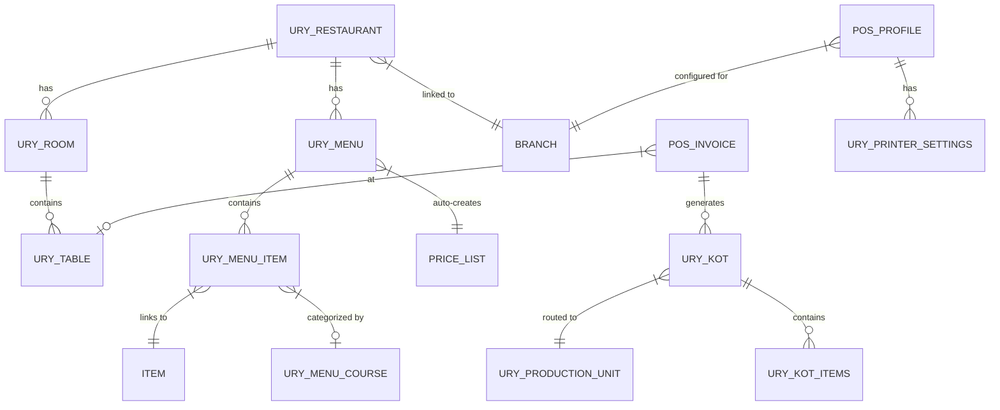

# 6. Code Refactor Plan

## Current Issues Identified

| Problem | Location | Impact |
|---------|----------|--------|
| Cart logic embedded in monolithic store | `pos/src/store/pos-store.ts` (695 lines) | Cannot reuse cart in customer apps |
| Menu API requires POS Profile | `ury_pos/api.py:getRestaurantMenu()` | Blocks any public/unauthenticated menu access |
| `sync_order` requires staff fields | `ury_order.py:sync_order()` lines 114-131 | Cannot create orders from customer apps |
| Branch resolution via user session | `ury_pos/api.py:getBranch()` | Blocks unauthenticated flows |
| No API abstraction layer | `pos/src/lib/*.ts` — raw frappe-js-sdk calls | Each new app would re-implement API calls |
| POS-specific UI mixed with reusable components | `pos/src/components/` | MenuCard reusable, but POSOpeningDialog is not |
| `URY Order` is `issingle=1` | `ury_order.json` line 229 | It's a page, not a data doctype — actual orders are POS Invoices |
| Duplicate POS Invoice query logic | `getPosInvoice` vs `getInvoiceForCashier` — ~120 lines duplicated | DRY violation |

## Phased Refactor

### Phase 0A: Extract Frontend Shared Packages

| Step | Changes | Files Affected | Risk |
|------|---------|---------------|------|
| 1. Add npm workspaces | Update root `package.json` with `"workspaces"` | `package.json` | Low |
| 2. Extract `@ury/ui` | Move `pos/src/components/ui/` → `packages/ui/` | All `pos/` imports | Low |
| 3. Extract `@ury/api-client` | Move `pos/src/lib/frappe-sdk.ts` → `packages/api-client/` + typed wrappers | All API files | Low |
| 4. Extract `@ury/cart` | Extract cart logic from `pos-store.ts` into standalone Zustand slice | `pos-store.ts` → `packages/cart/` | Medium |
| 5. Extract `@ury/menu` | Extract menu fetch + MenuCard + category filter | `menu-api.ts`, `MenuCard.tsx`, `MenuList.tsx` | Medium |
| 6. Extract `@ury/config` | Doctype constants, order types, currency config | `doctypes.ts`, `order-types.ts` | Low |

> **Migration note**: POS v2 (`pos/`) should be updated first to import from packages. POS v1 (`urypos/`) is Vue and can continue independently. Mosaic (`URYMosaic/`) stays untouched.

### Phase 0B: Backend API Refactoring

| Step | Changes | Files Affected | Risk |
|------|---------|---------------|------|
| 1. Create `ury_customer` module | New Frappe module for customer-facing APIs | **New**: `ury/ury_customer/` | Low |
| 2. Public menu endpoint | `get_public_menu(restaurant_slug)` — no auth required | `ury_customer/api.py` | Low |
| 3. Customer order endpoint | `create_customer_order()` — auto-assigns cashier, accepts guest | `ury_customer/api.py` | Medium |
| 4. Order status API | `get_order_status(order_token)` — returns fulfillment state | `ury_customer/api.py` | Medium |
| 5. QR token generator/validator | `generate_table_token(table)` / `validate_table_token(token)` | `ury_customer/auth.py` | Medium |
| 6. Payment gateway abstraction | New `URY Payment Gateway` doctype + API | **New**: `ury/ury_payment/` | High |
| 7. DRY the invoice queries | Unify `getPosInvoice`/`getInvoiceForCashier` into one parameterized function | `ury_pos/api.py` | Low |

---

# 7. Backend / API Readiness

## Current API Surface (Ordering-Related)

| API | Auth | Customer-Safe? | Notes |
|-----|------|---------------|-------|
| `getRestaurantMenu` | Staff session | ❌ | Requires POS Profile name |
| `sync_order` | Staff session | ❌ | Requires cashier, waiter, owner |
| `make_invoice` | Staff session | ❌ | Settles invoice, staff-only |
| `get_order_invoice` | Staff session | ❌ | Gets/creates POS Invoice |
| `getModeOfPayment` | Staff session | ❌ | From POS Profile |
| `getPosProfile` | Staff session | ❌ | Staff config |
| `getBranch` / `getRoom` | Staff session | ❌ | User → Branch mapping |
| `create_customer` | Staff session | ⚠️ | Logic reusable, needs guest wrapper |
| `fav_items` | Staff session | ⚠️ | Useful for returning customers |

## Required New APIs

### Customer Menu API
```python
# ury_customer/api.py — allow_guest=True
@frappe.whitelist(allow_guest=True)
def get_public_menu(restaurant, order_type=None):
    """Public menu by restaurant name/slug — no POS Profile needed"""
```

### Customer Order API
```python
@frappe.whitelist(allow_guest=True)
def create_customer_order(restaurant, items, customer_name=None, 
                          customer_phone=None, table_token=None,
                          order_type="Dine In", fulfillment=None):
    """Create order from customer apps. Auto-assigns cashier from active POS Opening."""
```

### Order Status API
```python
@frappe.whitelist(allow_guest=True)
def get_order_status(order_token):
    """Returns order status for customer tracking.
    States: placed → confirmed → preparing → ready → picked_up / served"""
```

### QR Table Token API
```python
@frappe.whitelist()
def generate_table_qr(table):
    """Staff generates signed JWT for table → QR code URL"""

@frappe.whitelist(allow_guest=True)
def validate_table_token(token):
    """Validates and returns {restaurant, table, room, menu}"""
```

### Payment Gateway API
```python
@frappe.whitelist(allow_guest=True)
def initiate_payment(order_id, gateway, amount, currency):
    """Creates payment intent/session with selected gateway"""

@frappe.whitelist(allow_guest=True)  
def verify_payment(order_id, gateway_reference):
    """Webhook/callback handler for payment confirmation"""
```

### WhatsApp Integration Points
Using `frappe_whatsapp` notification triggers on:
- **Order placed** → "We received your order #{{order_number}}" template
- **Order ready** → "Your order is ready for pickup!" template  
- **Invoice** → Attach PDF invoice to WhatsApp message
- **QR link** → Send table ordering link via WhatsApp message

---

# 8. Data and Domain Model Review

## Current Domain Model



## Current Fields Summary

| Doctype | Key Fields | Sufficient? |
|---------|-----------|-------------|
| **URY Restaurant** | company, branch, active_menu, default_tax_template, room_wise_menu, order_type_wise_menu | ✅ Good. Need: `slug`, `logo`, `opening_hours`, `accepts_online_orders` |
| **URY Menu** | enabled, price_list, items (child), branch | ✅ Good. Need: `is_public` flag |
| **URY Menu Item** | item, item_name, rate, special_dish, disabled, course | ✅ Good. Need: `description`, `allergens`, `dietary_tags` |
| **URY Table** | restaurant, room, branch, occupied, is_take_away, shape, seats, layout | ✅ Good. Need: `qr_token`, `qr_generated_at` |
| **URY Room** | room_type, branch, printer_settings | ✅ Sufficient |
| **URY KOT** | invoice, table, customer, type, production, order_status, timing | ✅ Sufficient |
| **POS Invoice** (custom fields) | restaurant, branch, table, room, order_type, waiter, cashier, arrived_time, aggregator_id | ⚠️ Need: `fulfillment_status`, `customer_token`, `pickup_time`, `payment_gateway_ref` |

## Required Domain Extensions

### New Fields on Existing Doctypes

| Doctype | New Field | Type | Purpose |
|---------|-----------|------|---------|
| URY Restaurant | `slug` | Data (unique) | URL-friendly identifier for public access |
| URY Restaurant | `accepts_online_orders` | Check | Enable/disable customer ordering |
| URY Restaurant | `opening_hours` | Small Text (JSON) | `{"mon": {"open": "09:00", "close": "22:00"}, ...}` |
| URY Restaurant | `logo` | Attach Image | For customer-facing branding |
| URY Table | `qr_token` | Data | Current signed token |
| URY Menu | `is_public` | Check | Whether menu visible to customers |
| POS Invoice | `fulfillment_status` | Select | Placed/Confirmed/Preparing/Ready/Served/PickedUp |
| POS Invoice | `customer_order_token` | Data | Token for anonymous order tracking |
| POS Invoice | `scheduled_pickup_time` | Datetime | When customer wants to pick up |
| POS Invoice | `payment_gateway` | Data | Which gateway processed payment |
| POS Invoice | `payment_gateway_ref` | Data | External payment reference ID |
| POS Invoice | `order_source` | Select | POS/QR/Online/Kiosk/WhatsApp |

### New Doctypes

| Doctype | Purpose | Key Fields |
|---------|---------|-----------|
| **URY Payment Gateway** | Payment provider configuration | gateway_name, provider (Stripe/Razorpay/PayPal/etc.), api_key, secret, webhook_url, active, currency, branch |
| **URY Customer Session** | Guest/OTP customer session tracking | phone, name, session_token, restaurant, created, last_active |
| **URY Fulfillment Log** | State transition audit trail | order, from_status, to_status, timestamp, actor |
| **URY Kiosk Device** | Kiosk device registration | device_id, restaurant, auth_token, last_active, name |

### Fulfillment State Machine

```
Placed → Confirmed → Preparing → Ready → Served (dine-in)
                                       → Picked Up (pickup/curbside)
                                       → Out for Delivery (delivery)
```

### Payment Gateway Support Strategy

For global reach, support multiple FOSS-friendly payment libraries:

| Gateway | Region | FOSS Library | Notes |
|---------|--------|-------------|-------|
| Stripe | Global | `stripe` Python SDK | Most mature, best for international |
| Razorpay | India | `razorpay` Python SDK | Dominant in India |
| PayPal | Global | REST API | Broad consumer adoption |
| Square | US/UK/CA/AU/JP | `squareup` SDK | Strong restaurant vertical |
| Mercado Pago | LATAM | REST API | Latin America coverage |
| Mollie | EU | `mollie-api-python` | European focus |
| Flutterwave | Africa | REST API | African market coverage |
| Tap | MENA | REST API | Middle East coverage |

> **Implementation**: Abstract behind `URY Payment Gateway` doctype. Each provider implements `initiate_payment()`, `verify_payment()`, `handle_webhook()`. Start with Stripe + Razorpay, others as plugins.
